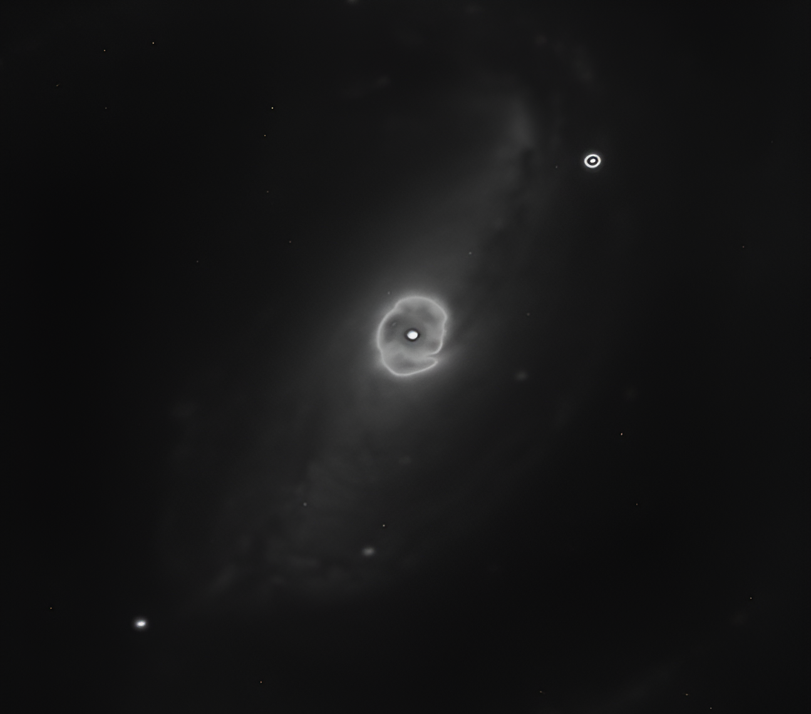

  
  
<em>Photograph I took during my time as an operator of the 2.15‑meter telescope at CASLEO.</em>

# Welcome!

## Nicolás Ottero

## Data Scientist | Data Analyst | Data Engineer | Astronomy Research

- I studied Data Science at [Instituto Data Science Argentina](https://institutodatascience.org/) and Astronomy at [UNC](https://www.unc.edu.ar/)
- I work with **astronomical data**, pipelines, statistical analysis, and machine learning  
- I'm interested in collaborating on **data science** projects applied to astrophysics

---
### 🛠  Tech Stack and Tools

                    

**Machine Learning Models**: Random Forest · Gradient Boosting · LSTM · Spline Interpolation · Time Series Forecasting

**Tasks**: Text classification · Named Entity Recognition · Tokenization · Custom pipelines

---

### 📫 Contact Me

---

  
# Investigación en curso

# Carbon Stars Lightcurve Modeling

Desarrollé un sistema completo para el análisis automatizado de estrellas de carbono a partir de datos fotométricos, integrando catálogos astronómicos, mediciones en banda Ks y modelos predictivos. El flujo de trabajo abarca desde la identificación precisa de las fuentes hasta la reconstrucción e interpolación de curvas de luz, incorporando técnicas de aprendizaje automático supervisado (Random Forest) y redes neuronales LSTM para predecir su evolución futura. El proyecto está documentado en cuatro notebooks en Kaggle, cada una dedicada a una etapa específica del proceso. Esta solución puede adaptarse a otros tipos de estrellas variables y contribuye a automatizar tareas que tradicionalmente se realizan de forma manual en astronomía.

Este trabajo fue publicado en la revista científica de la Asociación Argentina de Astronomía (AAA) en colaboración con el PhD. David Merlo. 

Acceso al código completo y a las explicaciones detalladas a través de notebooks en Kaggle:

1. [Catalog-Based Positional Matching of Carbon Stars](https://www.kaggle.com/code/nicolsottero/catalog-based-positional-matching-of-carbon-stars)
2. [Ks Band Photometric Extraction for Carbon Stars](https://www.kaggle.com/code/nicolsottero/ks-band-photometric-extraction-for-carbon-star)
3. [Modeling Carbon Star Light Curves with ML](https://www.kaggle.com/code/nicolsottero/modeling-carbon-star-light-curves-with-ml)
4. [Appendix: Modeling Carbon Star Variability](https://www.kaggle.com/code/nicolsottero/appendix-modeling-carbon-star-variability)

---

Acceso a la publicación revisada por pares de la Asociación Argentina de Astronomía (AAA):

* 📄 [Artículo publicado](https://drive.google.com/file/d/1wQlFtGvqs0r029vZ8lFyNmbOz6qsI1Gd/view)
* 📚 [Accede al volumen completo de la AAA para ver el artículo en su contexto. (p.109)](http://astronomiaargentina.org.ar/uploads/docs/baaa66.pdf)

---

La investigación avanza actualmente hacia una automatización completa mediante una interfaz basada en Streamlit y Docker, lo que permite su reproducibilidad y uso remoto. Se ha desarrollado una aplicación modular que procesa todo el flujo de trabajo, desde el procesamiento de catálogos hasta el modelado de curvas de luz, sin intervención manual. Actualmente estamos trabajando en mejorar el rendimiento predictivo reemplazando el modelo Random Forest por métodos de Gradient Boosting (como XGBoost y LightGBM), junto con una mejor ingeniería de características y validación sensible al tiempo. El Observatorio Astronómico de Córdoba (OAC) apoya el proyecto alojando el sistema, lo que facilita su acceso para pruebas continuas y uso científico.

---
